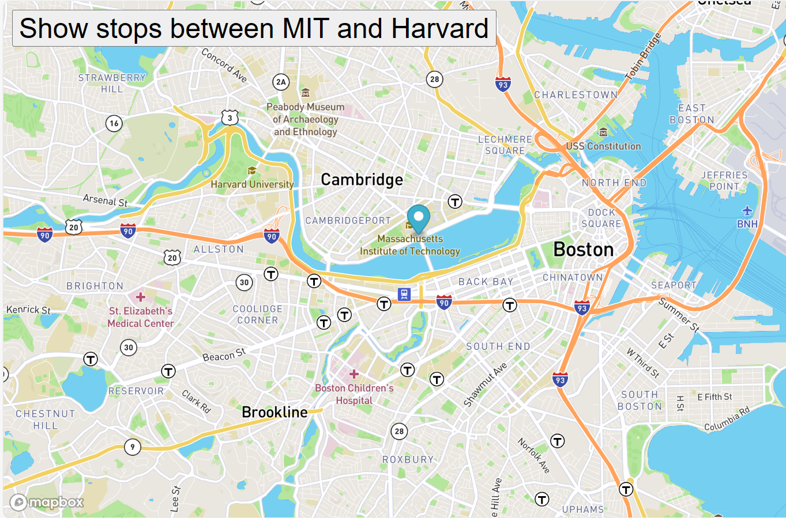

# Real_Time_Bus_Tracking

A website that uses mapbox API to source real-time data of the Boston MBTA buses and  display the live location of the busses on a map. 
MBTA bus data will be used to determine stops between Harvard and MIT.
An animated marker on the map highlights the bus routes.

## How to run the project on your computer
1. Fork the repository to your machine.
2. Create a Mapbox account and get the access token.
3. In the script add the access token where need3ed
 If your code works, you should be able to see a marker moving from one bus stop to the next on the map.

## what else can you do?
Use a map of a different state.

